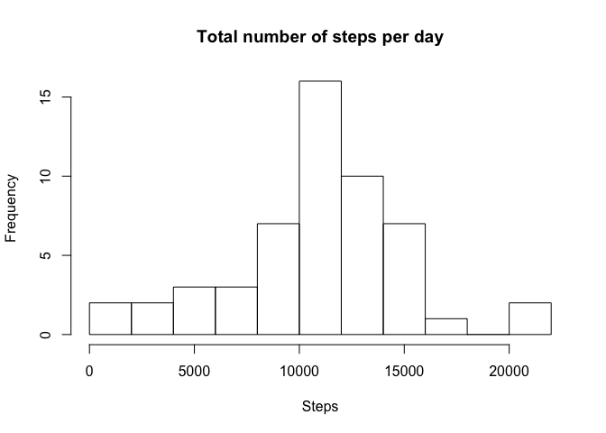
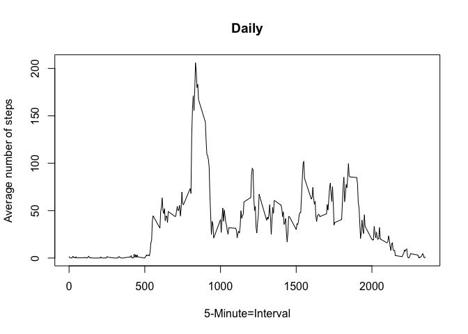
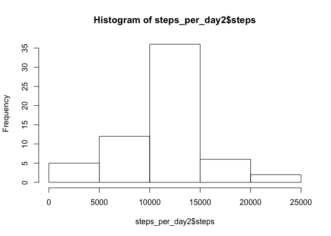
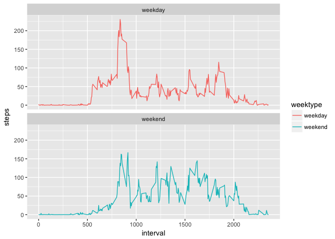

# Assignment 1

#Assignment 1, Reproducible data
Load R packages used in this document. 

```r
library(lubridate)
```

```
## 
## Attaching package: 'lubridate'
```

```
## The following object is masked from 'package:base':
## 
##     date
```

```r
library(dplyr)
```

```
## 
## Attaching package: 'dplyr'
```

```
## The following objects are masked from 'package:lubridate':
## 
##     intersect, setdiff, union
```

```
## The following objects are masked from 'package:stats':
## 
##     filter, lag
```

```
## The following objects are masked from 'package:base':
## 
##     intersect, setdiff, setequal, union
```

```r
library(ggplot2)
```

Load data activity.csv and assignn it to data. Use classes numeric, character and integer.

```r
data <- read.csv("activity.csv", header = TRUE, sep = ',', colClasses = c("numeric", "character", "integer"))
```

Show structure of the data.

```r
str(data)
```

```
## 'data.frame':	17568 obs. of  3 variables:
##  $ steps   : num  NA NA NA NA NA NA NA NA NA NA ...
##  $ date    : chr  "2012-10-01" "2012-10-01" "2012-10-01" "2012-10-01" ...
##  $ interval: int  0 5 10 15 20 25 30 35 40 45 ...
```

The date is not loaded properly. Therefore I used the as.date function.

```r
data$date <- as.Date(data$date)
```

#What is mean total number of steps taken per day?
For this part of the assignment, you can ignore the missing values in the dataset.

1. Calculate the total number of steps taken per day.

```r
steps_per_day <- aggregate(steps ~ date, data = data, sum, na.rm = TRUE)
head(steps_per_day)
```

```
##         date steps
## 1 2012-10-02   126
## 2 2012-10-03 11352
## 3 2012-10-04 12116
## 4 2012-10-05 13294
## 5 2012-10-06 15420
## 6 2012-10-07 11015
```

2. If you do not understand the difference between a histogram and a barplot, research the difference between them. Make a histogram of the total number of steps taken each day

```r
hist(steps_per_day$steps, 10, main="Total number of steps per day", xlab="Steps")
```

<!-- -->

3. Calculate and report the mean and median of the total number of steps taken per day.

Calculate Mean:

```r
mean(steps_per_day$steps)
```

```
## [1] 10766.19
```

Calculate Median:

```r
median(steps_per_day$steps)
```

```
## [1] 10765
```

##What is the average daily activity pattern?
4. Make a time series plot (i.e. 𝚝𝚢𝚙𝚎 = "𝚕") of the 5-minute interval (x-axis) and the average number of steps taken, averaged across all days (y-axis).

```r
avg_steps <- tapply(data$steps, data$interval, mean, na.rm = TRUE, simplify = T)
df.avg_steps <- data.frame(interval=as.integer(names(avg_steps)), steps=avg_steps)
```

Plot the average steps averaged across all days.

```r
plot(df.avg_steps$interval, df.avg_steps$steps, type = "l", xlab= "5-Minute=Interval", main="Daily", ylab= "Average number of steps")
```

<!-- -->

Which 5-minute interval, on average across all the days in the dataset, contains the maximum number of steps?

```r
df.avg_steps[which.max(df.avg_steps$mean),]
```

```
## [1] interval steps   
## <0 rows> (or 0-length row.names)
```

#Imputing missing values
Note that there are a number of days/intervals where there are missing values (coded as 𝙽𝙰). The presence of missing days may introduce bias into some calculations or summaries of the data.

First assign data to a new dataset called data_new

```r
data_new <- data
```

1. Calculate and report the total number of missing values in the dataset (i.e. the total number of rows with 𝙽𝙰s)

```r
sum(is.na(data_new$steps))
```

```
## [1] 2304
```

I've calculated the missing values in the column steps. Now I have to check whether there are no other missing values. 

```r
sum(is.na(data_new))
```

```
## [1] 2304
```

2. Devise a strategy for filling in all of the missing values in the dataset. The strategy does not need to be sophisticated. For example, you could use the mean/median for that day, or the mean for that 5-minute interval, etc.

Create a new dataset that is equal to the original dataset but with the missing data filled in with avg_steps.

```r
missing_rows <- is.na(data_new$steps)
data_new$steps[missing_rows] <- avg_steps[as.character(data_new$interval[missing_rows])]
```

Check whether there are no missing values left.

```r
sum(is.na(data_new))
```

```
## [1] 0
```

4.Make a histogram of the total number of steps taken each day and Calculate and report the mean and median total number of steps taken per day. Do these values differ from the estimates from the first part of the assignment? What is the impact of imputing missing data on the estimates of the total daily number of steps?


```r
steps_per_day2 <- aggregate(steps ~ date, data = data_new, sum, na.rm = TRUE)
hist(steps_per_day2$steps)
```

<!-- -->

Calculate Mean:

```r
mean(steps_per_day2$steps)
```

```
## [1] 10766.19
```
Mean doesn't differ from the calculation where I ignored the missing values.

Calculate Median:

```r
median(steps_per_day2$steps)
```

```
## [1] 10766.19
```
Median is a little bit lower than the calculation were I ignored the missing values.

#Are there differences in activity patterns between weekdays and weekends?
For this part the 𝚠𝚎𝚎𝚔𝚍𝚊𝚢𝚜() function may be of some help here. Use the dataset with the filled-in missing values for this part.

1. Create a new factor variable in the dataset with two levels – “weekday” and “weekend” indicating whether a given date is a weekday or weekend day.

```r
data_new <- mutate(data_new, weektype = ifelse(weekdays(data_new$date) == "zaterdag" | weekdays(data_new$date) == "zondag", "weekend", "weekday"))
data_new$weektype <- as.factor(data_new$weektype)
head(data_new)
```

```
##       steps       date interval weektype
## 1 1.7169811 2012-10-01        0  weekday
## 2 0.3396226 2012-10-01        5  weekday
## 3 0.1320755 2012-10-01       10  weekday
## 4 0.1509434 2012-10-01       15  weekday
## 5 0.0754717 2012-10-01       20  weekday
## 6 2.0943396 2012-10-01       25  weekday
```

2. Make a panel plot containing a time series plot (i.e. 𝚝𝚢𝚙𝚎 = "𝚕") of the 5-minute interval (x-axis) and the average number of steps taken, averaged across all weekday days or weekend days (y-axis). See the README file in the GitHub repository to see an example of what this plot should look like using simulated data.

Create interval_new

```r
interval_new <- data_new %>% group_by(interval, weektype) %>% summarise(steps = mean(steps))
```

Use ggplot to make a time series of the 5-minute interval for weekday and weekend.

```r
time_s <- ggplot(interval_new, aes(x=interval, y=steps, color=weektype)) + 
        geom_line() + 
        facet_wrap(~weektype, ncol=1, nrow=2)
print(time_s)
```

<!-- -->
On weekdays there are more activity in the beginning of the intervals. While on weekends the activity is more spread out.
